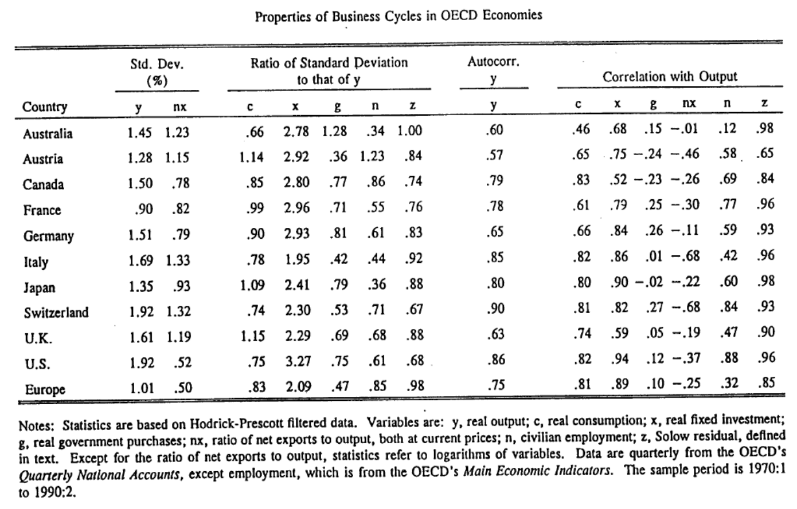
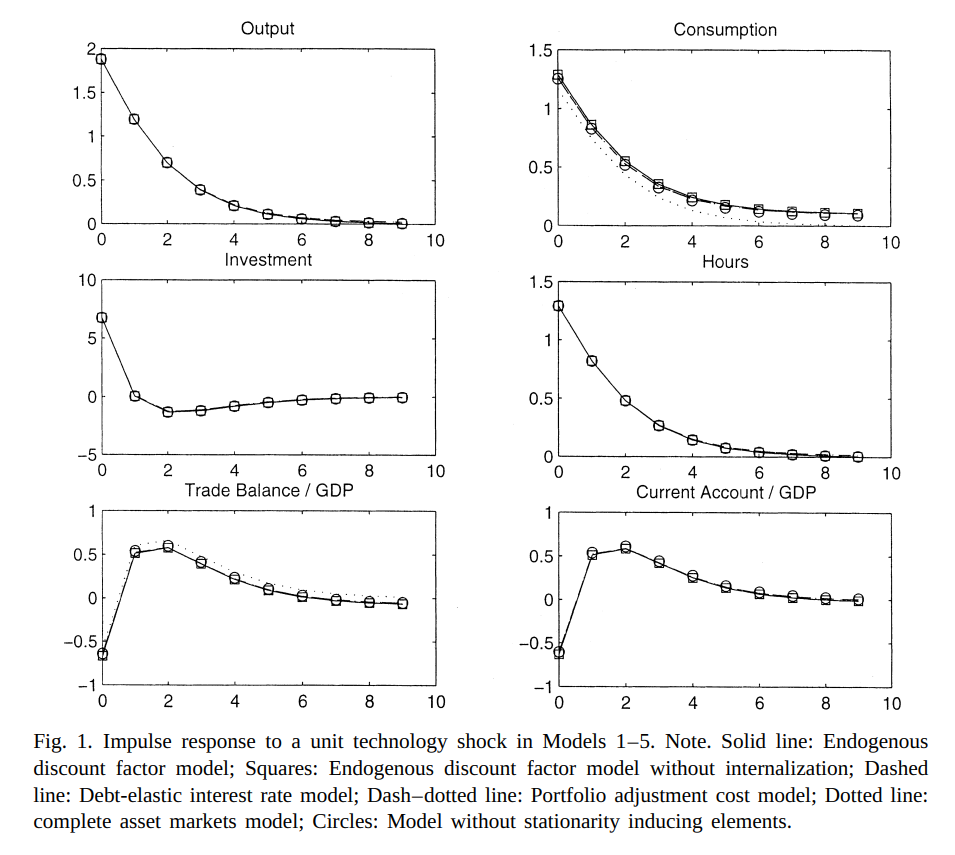

# Introduction et faits stylisés

## Pourquoi une petite économie ouverte ?

Quelles sont les raisons classiques d'ouvrir l'économie au commerce ?

::: incremental

- intégration commerciale
    - goût pour la variété
    - avantage comparatif
- intégration financière
    - lissage des chocs / assurance

:::

## Du modèle RBC au modèle IRBC

Les modèles RBC ont connu un très grand succès pour reproduire les cycles économiques

- victoire (temporaire) contre la vision keynésienne selon laquelle les fluctuations de court terme résultent de chocs de demande

. . .

Il n'a pas fallu longtemps avant que la même méthodologie soit appliquée aux cycles économiques internationaux

. . .

Article fondateur :

\ 

- [*International Real Business Cycles*](papers/Backus-InternationalRealBusiness-1992.pdf), Backus, Kehoe, Kydland (1992)

\ 

Grand succès méthodologique :

- les faits en contradiction avec les prédictions théoriques ont été appelés « puzzles »

## Faits empiriques des IRBC {auto-animate="true"}

D'après Kehoe,Kydland (1995)

## Faits empiriques des IRBC {auto-animate="true"}

::: columns
:::: {.column width=20%}

::::
:::: {.column width=80%}

::::
:::

## Faits stylisés

::: columns
:::: {.column width=20%}

::::

:::: {.column width=80%}

::::: incremental

Au niveau national :

:::::: {.fragment}

- la production est plus volatile que la consommation
- la production est autocorrélée
- la productivité est fortement procyclique
- autres variables corrélées positivement avec la production
- balance commerciale est fortement contracyclique

::::::
:::::: {.fragment}

Au niveau international :

- production corrélées positivement entre les pays
- correlations de la consommation nettement plus faible
    - Puzzle de Backus-Kehoe-Kydland

::::::

:::::

::::
:::

. . .

Pouvons-nous reproduire ces moments avec un modèle de cycles économiques ?

# Modélisation d'une petite économie ouverte

## Modèle de dotation

L'agent représentatif maximise :
$$\max_{c_t} \sum_{t=0}^{\infty} \beta^t u(c_t)$$
$$c_t + a_{t} \leq y_t + (1+r) a_{t-1} $$

::: r-stack

:::: {.fragment .current-visible}

__Économie de dotation__ :

- le revenu $(y_t)_t$ est donné de manière exogène
- par souci de simplicité, on suppose qu'il est déterministe

__Petite économie ouverte__ :

- *ouverte* : peut épargner $a_t$ ce qui rapporte $a_{t+1}(1+r)$ à la période suivante
- *petite* : le pays considère le taux d'intérêt mondial $r$ comme donné (pas d'effet sur les prix mondiaux)

::::
:::: {.fragment .current-visible}

Nous résolvons ce problème avec les conditions aux limites :

- $a_{-1}$ donné[^initial_condition]
- $\lim_{T\rightarrow\infty} \frac{a_{T}}{(1+r)^T}\geq0$ 

    - condition de transversalité (aka no-Ponzi condition)

La condition de pas de Ponzi va effectivement éliminer les solutions divergentes.

Dans une approximation au premier ordre, elle sélectionne les bonnes valeurs propres.

::::
:::

[^initial_condition]: Notez que la condition initiale est compatible avec les conventions Dynare que nous utilisons ici.

## Modèle de dotation (3)

Nous obtenons le Lagrangien :

$$\mathcal{L}= \sum_{t=0}^{\infty} \beta^t u(c_t) + \sum_{t=0}^{\infty} \beta^t \lambda_t \left(y_t + (1+r) a_{t-1} - c_t-a_{t} \right)$$

Conditions du premier ordre :

\begin{align}
u^{\prime}(c_t)& =& \lambda_t \\
 \lambda_t &=& \beta (1+r) \lambda_{t+1}
\end{align}

Sous l'*hypothèse technique* $\beta (1+r)=1$ nous obtenons $c_t=c_{t+1}$ et donc

$$c_0 = \frac{r}{1+r}\left\{ (1+r) a_{-1} + \sum_{t=0}^{\infty} \frac{y_t}{(1+r)^t}\right\}$$

. . .

::: {.incremental}

- la consommation est déterminée par le revenu permanent
    - les changements de richesse initiale ont des effets permanents
- *remarque* : problème isomorphe aux décisions d'épargne-consommation

:::

## Compte courant

::: {.callout-tip title="Rappels sur le compte courant"}

La __balance commerciale__ est les exportations moins les importations (ici $y_t-c_t$)

Le __compte courant__ est la balance commerciale plus les revenus nets de facteurs (ici $y_t-c_t+r a_{t-1}$)

Un __compte courant__ positif : le pays prête au reste du monde.

:::

. . .

En utilisant la formule d'avant

$$CA_0 =  a_{-1} r + (1-\frac{r}{1+r}) y_0 - \frac{r}{1+r}\left\{ \sum_{t\geq1}^{\infty} \frac{y_t}{(1+r)^t}\right\}$$

Comment le compte courant réagit-il aux chocs de revenu ?

. . . 

- le compte courant réagit positivement à un choc de revenu *temporaire*

- et négativement aux anticipations de chocs futurs de revenu :
    - C'est l'*approche intertemporelle* du compte courant

## Racine unitaire

Reprenons la formule de la consommation :
$$c_0 = \frac{r}{1+r}\left\{ (1+r) a_{-1} + \sum_{t=0}^{\infty} \frac{y_t}{(1+r)^t}\right\}$$

Rappelons aussi l'équation d'accumulation des actifs étrangers :
$$a_t = (1+r) a_{t} + y_t - c_t$$

Lorsque $a_{-1}$ augmente de $\Delta a_{-1}$, alors $c_0$ augmente de $r \Delta a_{-1}$.

En conséqence $a_0$ augmente d'exactement $\Delta a_{-1}$ (car $a_0 = (1+r) a_{-1} + y_0 - c_0$).

En itérant le raisonnement, $a_1, a_2, ...$ augmentent aussi d'exactement $\Delta a_{-1}$.

Et les consomations $c_1, c_2, ...$ augmentent d'exactement $r \Delta a_{-1}$.

. . .

Une augmentation de la richesse initiale a un __effet permanent sur les actifs étrangers__ et la consommation.

- cela correspondra à une racine unitaire dans la solution (valeur propre de module 1)

<!-- 
## Exercice

À partir des conditions du premier ordre 

\begin{align}
u^{\prime}(c_t) & = & \lambda_t \\
\lambda_t & = &  \beta (1+r) \lambda_{t+1}
\end{align}

en supposant $u(c_t) = \log (c_t)$, pouvez-vous obtenir l'équation de la loi de mouvement de $a_t$ et montrer la présence d'une racine unitaire ?
 -->

## Ajout du capital

Nous ajoutons le capital et la production à notre économie de dotation :
$$y_t = z_t k_{t-1}^\alpha$$
$$k_t = (1-\delta) k_{t-1} + i_{t}$$

La contrainte de ressource agrégée devient :

$$a_{t} + c_t + i_t = (1+r) a_{t-1} + y_t$$

On maximise alors $\sum_t \beta^ t U(c_t)$

. . .

Nous obtenons les conditions du premier ordre (exactement comme dans le RBC)

$$\lambda_t = \beta \lambda_{t+1} (1+r)$$
$$\lambda_t = \beta \lambda_{t+1}\left[ (1-\delta) + z_{t+1} f^{\prime}(k_{t}) \right]$$

où $\lambda_t$ est le multiplicateur de Lagrange associé à la contrainte budgétaire.

## Ajout du capital : conditions d'optimalité

Puisque $\lambda_t>0$ (la contrainte est toujours active), nous obtenons :

$$(1-\delta) + z_{t+1} f^{\prime}(k_{t}) = 1+r$$

$$k_{t} = \left( \frac{r+\delta}{\alpha z_{t+1}}\right)^{\frac{1}{\alpha-1}}$$

et l'investissement $$i_t = \left( \frac{r+\delta}{\alpha z_{t+1}}\right)^{\frac{1}{\alpha-1}}- (1-\delta)\left( \frac{r+\delta}{\alpha z_{t}}\right)^{\frac{1}{\alpha-1}}$$

. . .

Ici l'investissement est entièrement déterminé par les chocs de productivité

⇒ trop simple : 

- très corrélé avec la productivité
- pas de dépendance internationale
- ajustment immédiat du capital

<!-- 
## Les gains insaisissables de l'intégration financière

Note à côté :

Cf : Gourinchas et Jeanne *The elusive gains from financial integration.
L'ajustement immédiat du capital fournit une limite supérieure aux gains de l'intégration financière.
 -->

## Ajout de frictions à l'investissement

Une solution possible : modifier la contrainte de ressource de sorte que l'ajustement du capital soit coûteux

Par exemple :

$$a_{t} + c_t + i_t + \frac{\omega}{2}\frac{(k_{t}-k_{t-1})^ 2}{k_t} = (1+r)a_{t-1} + z f(k_{t-1})$$

$$k_{t} = (1-\delta) k_{t-1} + i_t$$

où $\omega$ est un paramètre de friction d'ajustement.

. . .

En général, $\omega$ est choisi de sorte que le modèle reproduise $\frac{Var(i_t)}{Var(y_t)}$ à partir des données.

. . .

🔜 Cf tutoriel.

# Un modèle de petite économie ouverte de référence

## Un modèle de petite économie ouverte de référence

::: columns

:::: column

{width=60%}

::::

:::: column

[*Closing Small Economy Models*](papers/1-s2.0-S0022199602000569-main.pdf), Schmitt Grohe and Uribe (2003), JIE

- modèle de petite économie ouverte avec production, arbitrage consommation-loisir et coûts d'ajustement du capital
    - = RBC + ouverture + coûts d'ajustement
- réalise exercice de moment-matching
- compare différentes façons de stationnariser le modèle (pour se débarrasser de la racine unitaire)

::::
:::

## Le modèle

$$\max_{c_t, n_t} \sum_{t=0}^{\infty} \beta^t u(c_t, n_t)$$

$$c_t + k_{t} + a_{t} = y_t + g_t - \frac{\omega}{2}(k_{t}-k_{t-1})^2 +(1-\delta) k_{t-1} + (1+r^{\star}+{\color{red}\pi(a_{t-1})})a_{t-1}$$
$$y_t = f(k_{t-1}, n_t, z_t)$$

$$z_{t+1} = \rho z_t + \epsilon_{t+1}$$

et $$u(c, n) = \frac{1}{1-\sigma}\left(c^{\psi}(1-n)^{1-\psi}
)\right)^{1-\sigma}$$

. . .

Le terme $\color{red}\pi$ est là pour rendre le modèle stationnaire.

## Comment rendre la distribution stationnaire ?

Sans $\color{red}\pi$ la solution du modèle présente une racine unitaire :

$$a_t = a_{t-1} + ... \text{autres variables en t-1} + \text{chocs en t}$$

. . .

Problème :

- il n'existe pas d'état stationnaire déterministe unique
- la distribution ergodique des variables du modèle n'est pas définie

Cela soulève des problèmes pratiques (notamment pour l'estimation) pour le modèle *linéaire*.

- pas de moments sans condition

## Comment se débarrasser de la racine unitaire ?

*Idée générale* :

- introduire une force qui tire le niveau des actifs étrangers vers l'équilibre

Schmitt Grohe and Uribe (2003) considèrent de nombreuses options :

::: r-stack

:::: {.fragment .current-visible}

- taux d'intérêt élastique à la dette :
    $$1+r = 1+r^{\star} + \pi(a_d)$$
    - avec $\pi(0)=0$ et $\pi^{\prime}(0)>0$
    - $\pi$ peut être compris comme une prime de risque sur l'augmentation de la dette

::::

:::: {.fragment}

- facteur d'actualisation endogène (alias préférences à la Uzawa)
    $$\beta(c_t) = (1+c_t)^{-\chi}$$
- coûts d'ajustement pour les portefeuilles internationaux

::::

:::

. . .

SGU montrent que le choix du dispositif de stationnarisation a peu d'effet sur la dynamique (moments) de la plupart des variables

## Calibrage

::: columns

:::: column

| Paramètres  | Valeurs  |
|-------------|----------|
| $σ$           | 2        |
| $ψ$           | 1.45     |
| $α$           | 0.32     |
| $ω$           | 0.028    |
| $r$           | 0.04     |

::::
:::: column

| Paramètres  | Valeurs  |
|-------------|----------|
| $δ$           | 0.1      |
| $ρ$           | 0.42     |
| $σ²$          | 0.0129   |
| $A^{\star}$ | -0.7442  |
| $χ$           | 0.000742 |

::::
:::

## Résultats

{height=60%}

##

{height=60%}

## Conclusions

- Le modèle reproduit assez bien les corrélations inconditionnelles
    - Le dispositif de stationnarisation a peu d'effet sur les moments
- Les corrélations conditionnelles ne sont pas très bonnes
    - une limitation de la méthode de matching de moments ?
- La corrélation de la consommation avec la production est trop élevée
    - et la corrélation internationale des consommations est trop élevée dans le modèle
    - ... toujours le puzzle de Backus-Kehoe-Kydland...