# Hétérogénéité dans les modèles

##

Les modèles DSGE sont souvent critiqués pour leurs hypothèses peu réalistes.

. . .

Exemple :

- [*Macroeconomic Policy in DSGE and Agent-Based Models*](https://www.cairn.info/revue-de-l-ofce-2012-5-page-67.htm) dans la Revue de l'OFCE

- *À cet égard, la Grande Récession s'est révélée être une expérience naturelle pour l'analyse économique, montrant l'inadéquation des cadres théoriques dominants. En effet, un nombre croissant d'économistes de premier plan affirment que l'actuelle « crise économique est une crise de la théorie économique » (Kirman, 2010 ; Colander et al., 2009 ; Krugman, 2009, 2011 ; Caballero, 2010 ; Stiglitz, 2011 ; Kay, 2011 ; Dosi, 2011 ; Delong, 2011). Les hypothèses de base des modèles DSGE dominants, par exemple les anticipations rationnelles, les agents représentatifs, les marchés parfaits, etc., empêchent de comprendre les phénomènes fondamentaux à l'origine de la crise économique actuelle.*

. . .

Mais :

- les modèles dominants incorporent en général de nombreux éléments non classiques. Par exemple, les modèles néo-keynésiens intègrent la concurrence imparfaite.

- il faut distinguer les modèles dominants de la méthodologie DSGE.
    - aujourd'hui : un modèle DSGE avec une conclusion plutôt radicale.

## Agent représentatif

\ \ 

Sous l'hypothèse d'__agent représentatif__

- les choix agrégés résultent d'un seul problème d'optimisation ;
- ☡ il peut y avoir des restrictions sur ce qui est internalisé par l'agent.

. . .

Est-ce une hypothèse simplificatrice ? Ou est-ce en réalité équivalent à l'agrégation de nombreux problèmes d'optimisation ?

. . . 

Si oui, il faut une théorie de l'agrégation[^cherrier]...

. . .

... qui se brise rapidement (par exemple quand les fonctions d'utilité sont hétérogènes).

\ 

__Exemple__ pour le modèle néoclassique / RBC:

- le secteur productif peut être agrégé car les entreprises sont de type Cobb-Douglas, en comptition parfaite) ;
- les consommateurs peuvent être agrégés si leur utilité est logarithmique et qu'il n'y a pas d'incertitude.

[^cherrier]: voir [Household heterogeneity in macroeconomic models: A historical perspective](https://www.sciencedirect.com/science/article/pii/S0014292123001265) (ou un [blog](https://beatricecherrier.wordpress.com/2018/11/28/heterogeneous-agent-macroeconomics-has-a-long-history-and-it-raises-many-questions/) plus ancien) pour l'histoire des agents hétérogènes.

<!-- ## Exemple avec le modèle néoclassique

Considérons trois versions du modèle néoclassique :

- entièrement décentralisée (beaucoup d'entreprises, beaucoup de consommateurs) ;
- agent représentatif ;
- problème du planificateur.

Remarque :

- pour le modèle néoclassique, il existe une théorie d'agrégation du secteur productif (les entreprises sont de type Cobb-Douglas) ;
- deux hypothèses sont nécessaires pour agréger les consommateurs : utilité logarithmique et absence d'incertitude. -->

## Agents hétérogènes

Certains économistes ont reconnu très tôt la nécessité de modéliser explicitement l'hétérogénéité.

- __Économie de Bewley__ (1977)

    - dotation stochastique idiosyncratique ;
    - modèle consommation-épargne avec contraintes d'emprunt ;
    - conduit à de l'*hétérogénéité ex post* (contraints/non contraints), donc à des réactions différentes.

- __Économie de Huggett__ (1993)
    
    - *hétérogénéité ex ante* supplémentaire dans le processus de revenu *idiosyncratique*.

- __Modèle d'Aiyagari__ (1994)

    - l'épargne est investie pour accumuler du capital agrégé ;
    - modèle consommation-épargne avec contraintes d'emprunt ;
    - chocs de productivité idiosyncratiques (salaire).

- __Modèle de Krusell et Smith__ (1998)

    - Aiyagari + chocs agrégés ($\approx$ RBC + hétérogénéité) ;

Ces modèles exigent des techniques de calcul particulières et étaient mal compris sur le plan mathématique.

## Jeux à champ moyen et modèles à agents hétérogènes {auto-animate="true"}

__2012__ Ben Moll donne un exposé à l'IMA (Royaume-Uni).

. . .

. . .

Économistes et mathématiciens de tout premier plan échangent autour des *jeux à champ moyen*.

- une classe de problèmes mathématiques qui englobe les modèles à agents hétérogènes ;
- assez exigeante mathématiquement (calcul stochastique, théorie de la viscosité, ...).

## Jeux à champ moyen et modèles à agents hétérogènes {auto-animate="true"}

::: columns

:::: {.column width=30%}

__2012__ Ben Moll donne un exposé à l'IMA (Royaume-Uni).

::::

:::: column

__Résultat__ : une nouvelle vague d'articles sur les agents hétérogènes.

- PDE Models in Macroeconomics (2014), avec Achdou, Bueary, Lasry, Lions

- The Dynamics of Inequality (2016), avec Gabaix, Lasry, Lions

- Monetary Policy According to HANK (2018), avec Kaplan et Violante
    
    - celui-ci a eu un succès énorme.

::::

:::

## HANK, HANK HANK, ...

- *Monetary Policy According to HANK* (2018), de Moll, Kaplan et Violante

    - HANK : Heterogeneous Agents New Keynesian ;
    - étudie les conséquences inégales des politiques monétaires ;
    - un nouveau modèle de référence pour les [banques centrales](https://www.imf.org/en/Publications/fandd/issues/2023/03/modern-monetary-policy-kaplan-moll-violante).

. . .

::: {.enumerate}

- A stimulé toute une littérature[^representative]

    - *Understanding HANK: Insights from a PRANK*[^prank]
    - *When HANK meets SAM*
    - *HANK beyond FIRE*
    - *Aggregate Demand: THANK (Tractable HANK) and TANK* by Florin Bilbiie
        - idée principale : il n'est pas nécessaire d'avoir plus de deux agents pour obtenir les principaux résultats.

:::

[^prank]: pseudo modèle néo-keynésien représentatif
[^representative]: les références listées ne sont pas forcément les plus représentatives

## Consommateurs hétérogènes

Pourquoi est-il important de modéliser l'hétérogénéité des consommateurs ?

. . .

- Pour reproduire des décisions de consommation réalistes.

. . .

Classiquement, on distingue deux types d'agents :

::: columns

:::: column

::::: {.callout-note}

#### Ménages ricardiens

Agents qui peuvent réallouer librement leur consommation dans le temps.

Ils ont une forte propension marginale à consommer à partir d'un revenu additionnel.

:::::

\ \ 

Les ménages ricardiens choisissent de ne pas consommer davantage aujourd'hui afin de consommer davantage demain.

::::
:::: column

::::: {.callout-note}

#### Ménages keynésiens
Agents dont la consommation de la période courante est limitée par une contrainte de crédit active. Soit ils ne peuvent pas emprunter du tout, soit le montant qu'ils peuvent emprunter est limité aujourd'hui.

Ils ont une forte propension marginale à consommer à partir d'un revenu additionnel.

:::::

Les ménages keynésiens consomment aujourd'hui autant qu'ils le peuvent.

::::
:::

. . .

L'agent représentatif suppose que tout le monde est ricardien.

Que disent les données ?

---

Regardons la distribution des PMC en France.[^mpc_1_source]

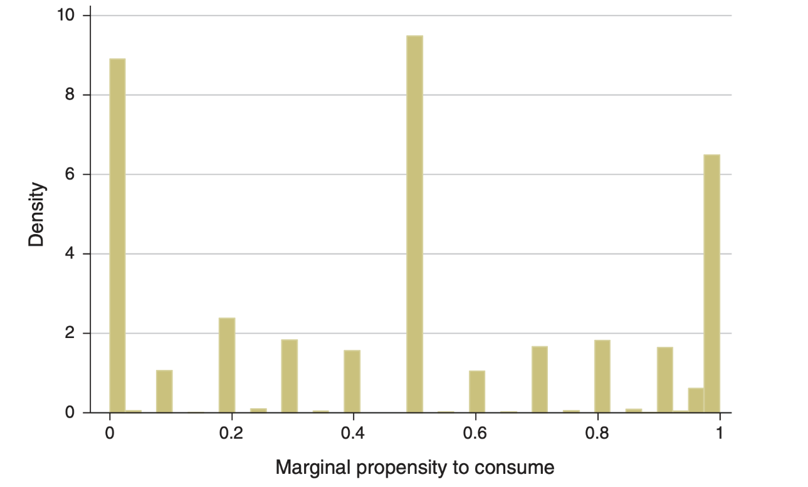{width=60%}

[^mpc_1_source]: D'après <u>From Fiscal Policy and MPC Heterogeneity</u>, Tullio Jappelli et Luigi Pistaferri, American Economic Journal: Macroeconomics, 2014

---

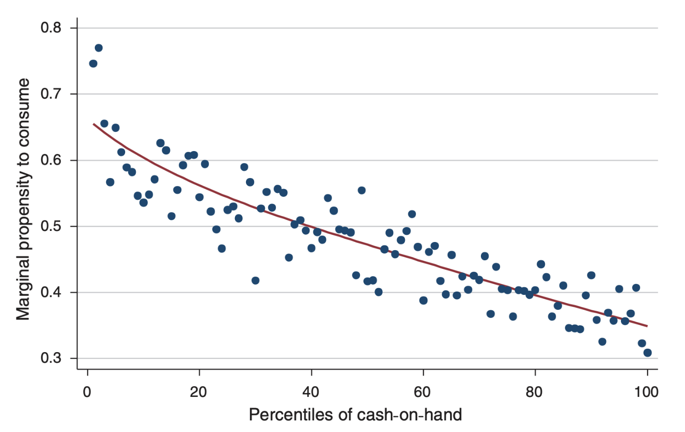{width=60%}

. . .

Il semble que la PMC soit bien prédite par le cash-in-hand (montant d'argent restant au ménage après tous les paiements obligatoires).

---

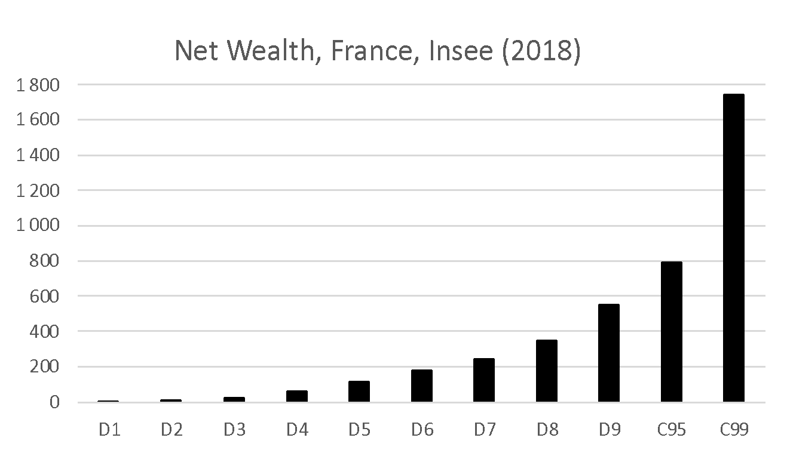{width=60%}

---

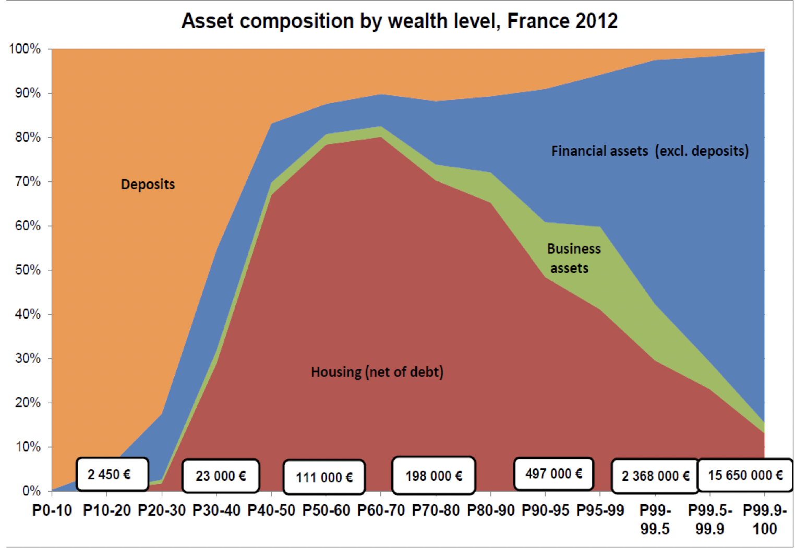{width=60%}

. . . 

Les agents au milieu de la distribution de patrimoine ont un crédit immobilier dont les intérêts laissent très peu à dépenser après paiements. Ils ont donc un cash-in-hand plus faible, et une propension marginale à consommer plus élevée (que les agents riches).

---

## Agents « wealthy hand-to-mouth »

On vient de voir que les agents situés au milieu de la distribution de patrimoine détiennent une plus grande part de leur richesse sous forme d'actifs illiquides (immobilier).

- Leur cash in hand (disponible pour des achats immédiats) est réduit. Une part importante de leur revenu sert à rembourser leur emprunt.
- Ils ont une PMC plus élevée.
- Ils réagissent aussi aux variations de taux d'intérêt (notamment ceux qui ont des taux variables).
- « Monetary Policy According to HANK » (2018), Kaplan, Moll et Violante, souligne le rôle des « wealthy hand-to-mouth » et la nécessité de prendre leur existence en compte pour évaluer l'influence des politiques monétaires.

---

## Comment modéliser les différences de PMC ?

::: {.incremental}

- Spécifier plusieurs types d'agents :

    - ricardiens ;
    - hand-to-mouth (consommation = revenu) ;
    - -> hétérogénéité *ex ante*.

- En endogénéisant la contrainte d'emprunt

    - nécessite une résolution non linéaire ;
    - hétérogénéité *ex post* ;
    - avec éventuellement des paramètres idiosyncratiques comme le facteur d'actualisation - - ->(*hétérogénéité ex ante*).

- En introduisant une préférence pour la richesse
    
    - c'est ce qui suit.

:::

# Inégalités, levier et crise

## 

::: columns

:::: column

::::

:::: column

::::

:::

[*Inequality, Leverage and Crisis*](papers/leverage_and_crisis.pdf), Kumhof, Rancière, Winant (2015)

## Introduction

La crise financière de 2007 a d'abord été une crise des prêts hypothécaires *subprimes*.

::: {.incremental}

- fort endettement des ménages à bas revenus ;
- alimenté par un crédit facile (taux faibles) et des prix de l'immobilier élevés ;
- titrisation de la dette
    - y compris pour des dettes très risquées (*subprimes*) ;
    - dont 90 % avaient des taux variables et/ou des paiements ballon ;
- hausse (modérée) des taux d'intérêt
    - éclatement de la bulle immobilière ;
    - les ménages n'ont pas pu refinancer leurs prêts ;
    - ... et ont fait défaut ;
- le marché des MBS s'est effondré...
- ... et avec lui l'ensemble du secteur financier.

:::

. . .

D'accord, mais d'un point de vue macroéconomique, qu'est-ce qui a alimenté de tels niveaux d'endettement ?

##

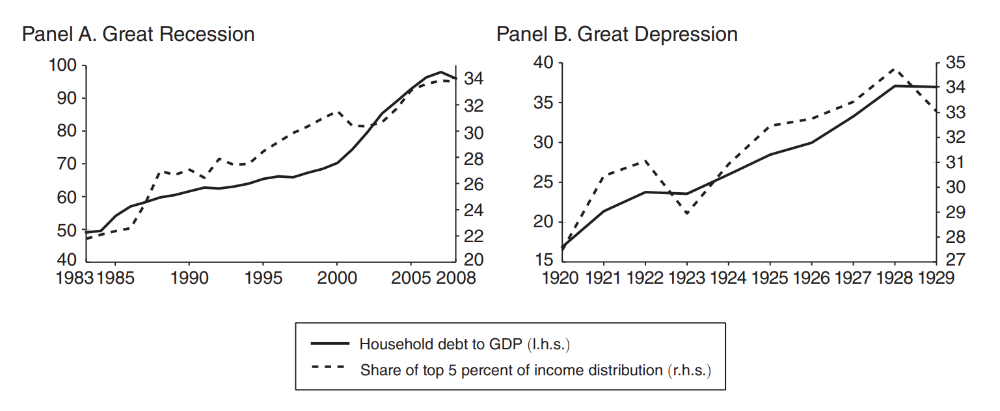

Un schéma similaire est apparu avant la Grande Récession et avant la Grande Dépression :[^saez]

- hausses parallèles des *inégalités de revenu* et du ratio dette/revenu.

[^saez]: données d'inégalités issues de Saez et Zucman

##

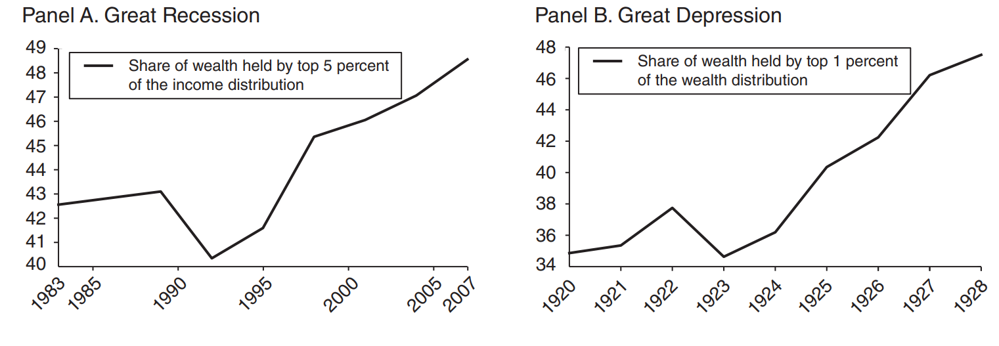

La hausse des *inégalités de patrimoine* est cohérente.

##

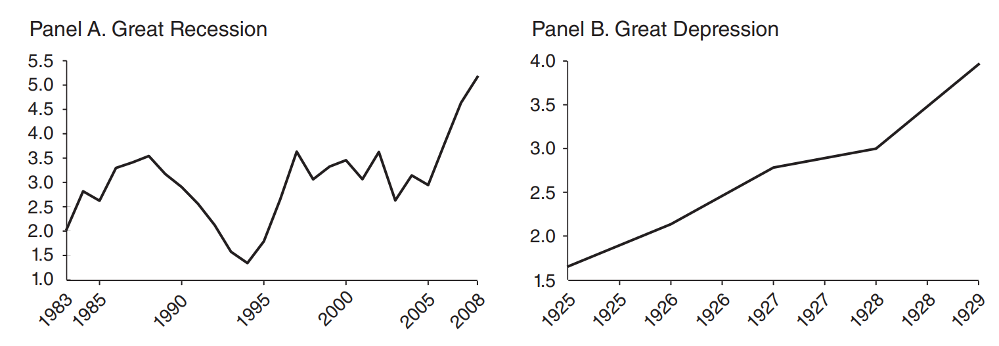

Les mesures économétriques du risque de défaut des ménages [^schularick] augmentent de façon soutenue.

[^schularick]: D'après Schularick et Taylor (2014)

<!-- ##

##

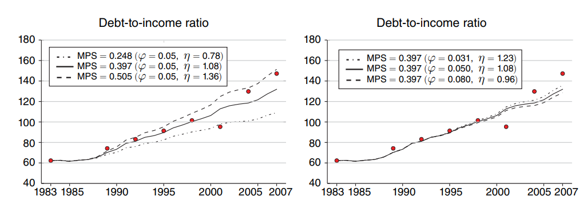 -->

## Modèle

Qu'est-ce qui pourrait relier la hausse des inégalités de revenu à l'augmentation de l'endettement des ménages du bas de la distribution ?

Intuition :

- les hauts revenus ont une propension marginale à épargner plus élevée ;
- quand leur revenu augmente, ils prêtent aux bas revenus ;
- et la hausse de la dette augmente le risque de défaut.

Voyons comment modéliser cela dans un cadre DSGE (en omettant le risque de défaut pour simplifier).

## Dotations

On considère une économie de dotation :

- Production totale

$$y_t = (1-\rho_y) \overline{y} + \rho_y y_{t-1} + \epsilon_{y,t}$$

- Choc d'inégalités

$$z_t = (1-\rho_z) \overline{z} + \rho_z z_{t-1} + \epsilon_{z,t}$$

Commentaires :

- $z_t$ est la fraction de la production totale reçue par les hauts revenus. Le reste est reçu par les bas revenus.
- On suppose qu'il existe une fraction $\chi$ de hauts revenus.

- notre objectif est d'étudier l'effet d'un choc d'inégalités persistant (avec $\rho_z=1$)
    - il nous faut donc un mécanisme permettant une propension marginale à épargner non nulle après un choc de revenu persistant.

## Hauts revenus

On choisit la fonction d'utilité suivante pour les hauts revenus : $$U_t = E_t \sum_{k\geq0}^{\infty} \beta^k_{\tau} \left\{ \frac{\left(c^{\tau}_{t+k}\right)^ {1-\frac{1}{\sigma}}}{1-\frac{1}{\sigma}} + \varphi \frac{\left( 1+b_{t+k}\frac{1-\chi}{\chi}\right)^{1-\frac{1}{\eta}}}{1-\frac{1}{\eta}} \right\}$$

. . .

Consommation : $$c^{\tau}_t = y_t z_t \frac{1}{\chi} + \left(b_{t-1}-b_t p_t\right)\frac{1-\chi}{\chi}$$ où $b_t$ désigne les détentions de dette et $p_t$ son prix, soit $1/r_t$.

. . .

Condition d'optimalité issue de $\max U_t$

$$p_t = \beta_{\tau} E_t\left[ \left( \frac{c^{\tau}_{t+1}}{c^{\tau}_t}\right)^ {-\frac{1}{\sigma}}\right] + \varphi \frac{\left(1+b_t \frac{1-\chi}{\chi}\right)^ {-\frac{1}{\eta}}}{\left(c_t^{\tau}\right)^ {-\frac{1}{\sigma}}}$$

## Préférence pour la richesse

La préférence pour la richesse peut se justifier par :

- une préférence pour le statut social ;
- l'esprit du capitalisme.

__Intuitivement__: les utilités de la consommation et de la richesse sont complémentaires. Si la consommation augmente, les individus veulent détenir plus de richesse. C'est ce qui ce passe lorsque le revenu augmente de manière permanente: la consommation augmente mécaniquement. 

__Remarque__: sans la préférence pour la richesse, la condition $c_t = c_{t+1}$ implique qu'une augmentation permanente du revenu entraîne une augmentation équivalente de la consommation, ce qui conduit à une propension marginale à consommer de 100 % après un choc de revenu permanent.

## Préférence pour la richesse: condition d'équilibre

On peut réécrire la condition d'Euler à l'état d'équilibre:

::: columns

:::: column

$$
\frac{\color{blue}{p}-\beta_\tau}{\varphi}
=
\frac{\left(\overline{y}\,\overline{\color{red}{z}}\,\frac{1}{\chi}+\overline{\color{green}{b}}(1-\color{blue}{p})\frac{1-\chi}{\chi}\right)^{\frac{1}{\sigma}}}{\left(1+\overline{\color{green}{b}}\frac{1-\chi}{\chi}\right)^{\frac{1}{\eta}}}
$$

::::

:::: column

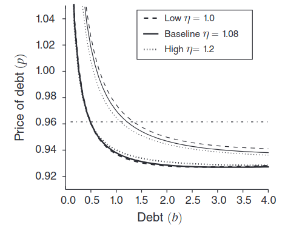

::::

:::

La condition montre l'offre de prêt $\overline{\color{green}{b}}$ à l'équilibre (i.e. l'épargne des hauts revenus) en fonction du taux s($r=1/\color{blue}{p}$).

Elle implique aussi une augmentation de l'offre de prêt d'équilibre lorsque la part $\overline{\color{red}{z}}$ des hauts revenus augmente (déplacement vers la droite de la courbe d'offre de prêt).

::: {.incremental}

- la PMC est non nulle  à long terme après un choc de revenu permanent
- c'est aussi le cas à court terme (cf simulations)
- Les paramètres $\eta$ et $\varphi$ ne sont pas observés, mais peuvent être choisis pour reproduire la PMC observée dans les données (50 % pour les hauts revenus).

:::

## Bas revenus

Les bas revenus sont standards :

$$V_t = E_t \sum_{k \geq 0}^{\infty} \beta^k_b \left( \frac{\left(c_{t+k}^b\right)^ {1-\frac{1}{\sigma}}}{1-\frac{1}{\sigma}} \right)$$

Contrainte budgétaire :

$$c^b_t = y_t(1-z_t)\frac{1}{1-\chi} + \left(b_t p_t - b_{t-1}\right)$$

Condition d'optimalité issue de $\max V_t$

$$p_t = \beta^b E_t \left[ \left( \frac{c_{t+1}^b}{c_t^b}\right)^{-\frac{1}{\sigma}} \right]$$

##

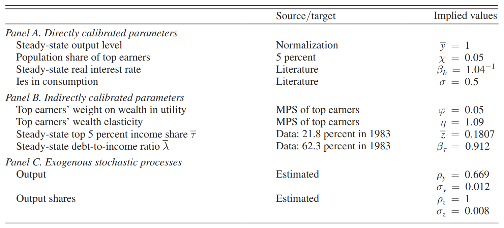

##

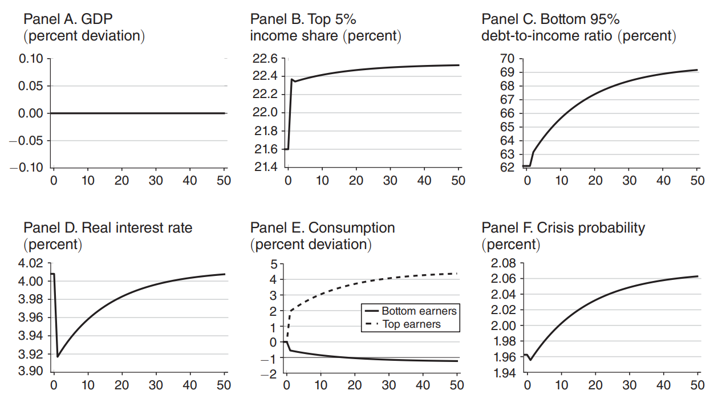

## {auto-animate="true"}

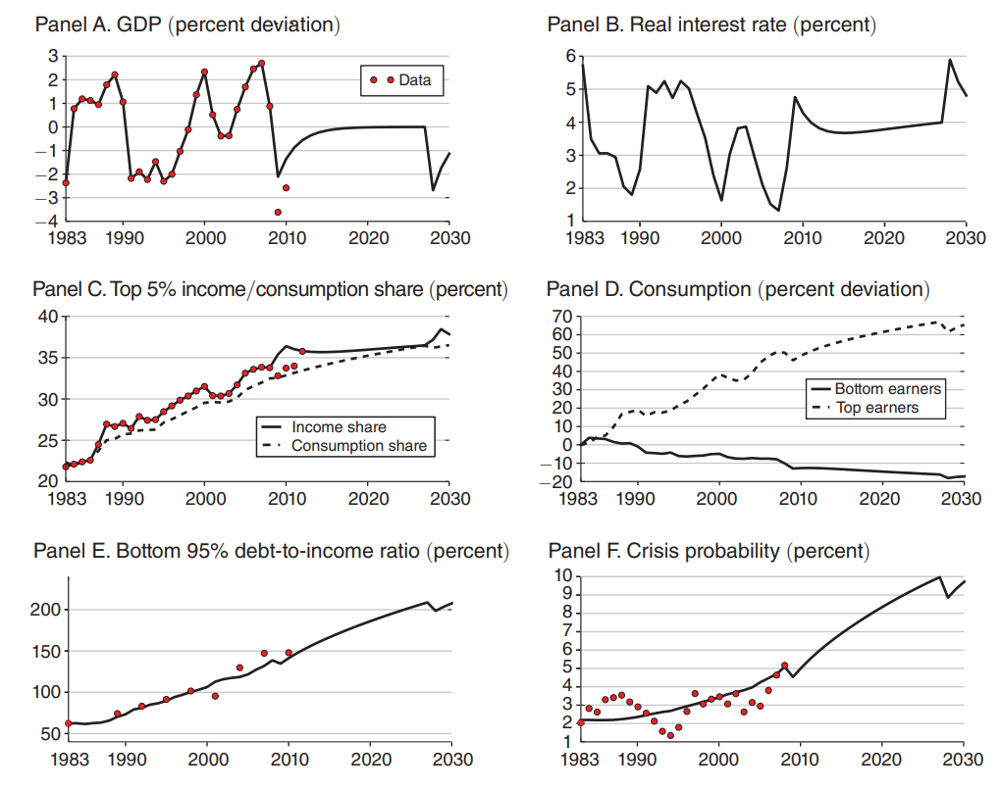

## {auto-animate="true"}

::: columns

:::: column

::::

:::: column

__Conclusion__

Dans la simulation, nous utilisons les valeurs historiques des chocs exogènes (production et inégalités).

On reproduit assez bien l'évolution du ratio dette/PIB de 1983 à 2010:

- on peut expliquer lla hausse de l'endettement des ménages par la hausse des inégalités de revenu

Le modèle entier contient aussi un mécanisme de défaut des ménages, que l'on a omis ici.

\ 

__Discussion__: quel est le pouvoir prédictif du modèle ?

- on reproduit *un seul* moment :  ratio dette/PIB de 1983 à 2010
- il pourrait exister d'autres mécanismes un chocs sur les anticipations des revenus futurs ou sur les taux d'intérêt

::::

:::