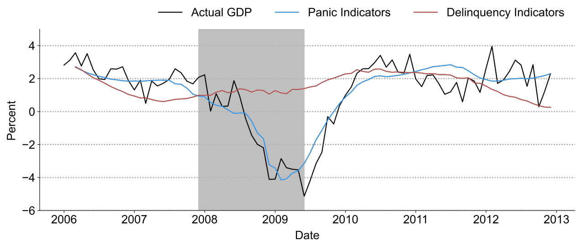
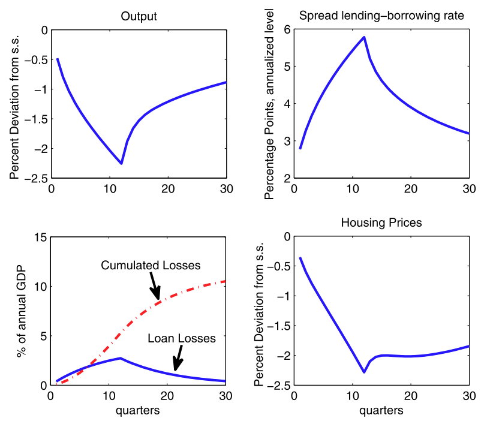
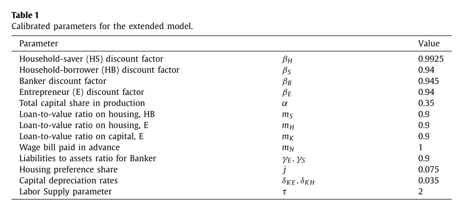
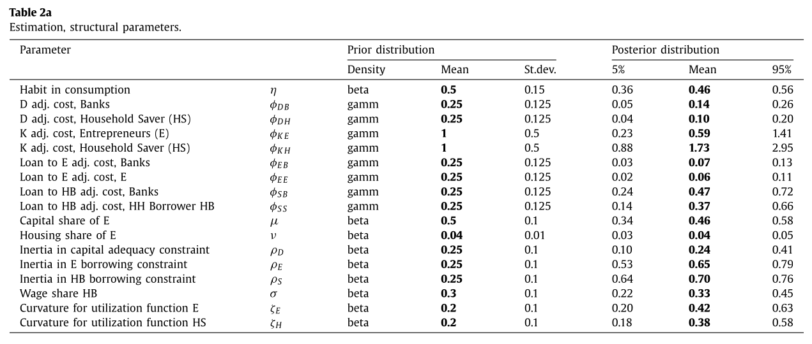
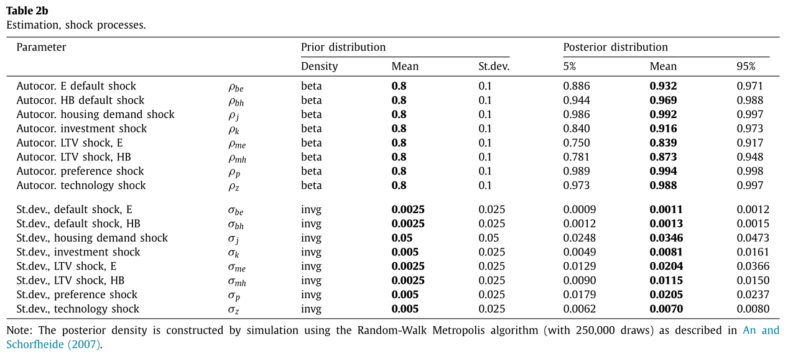
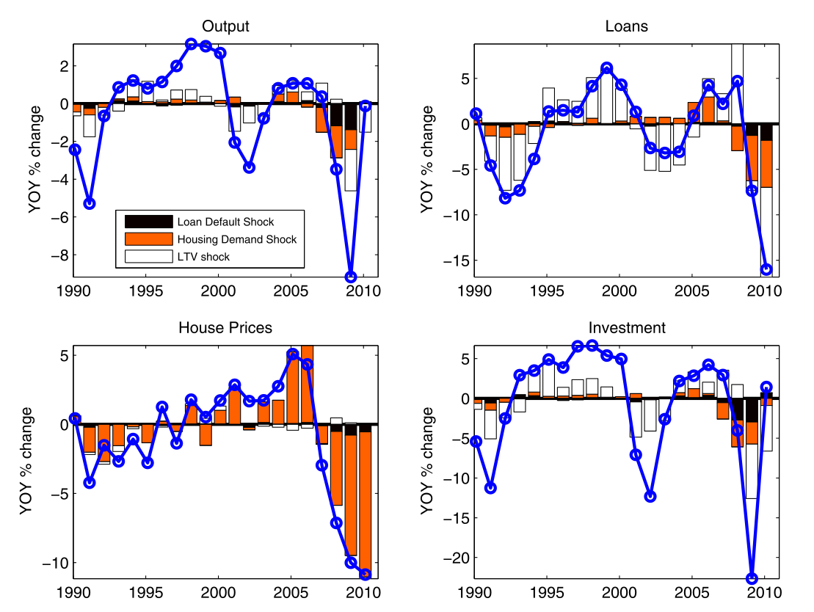
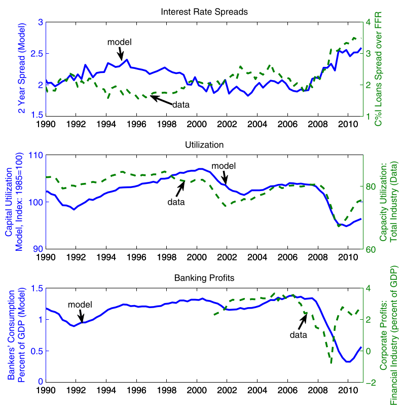
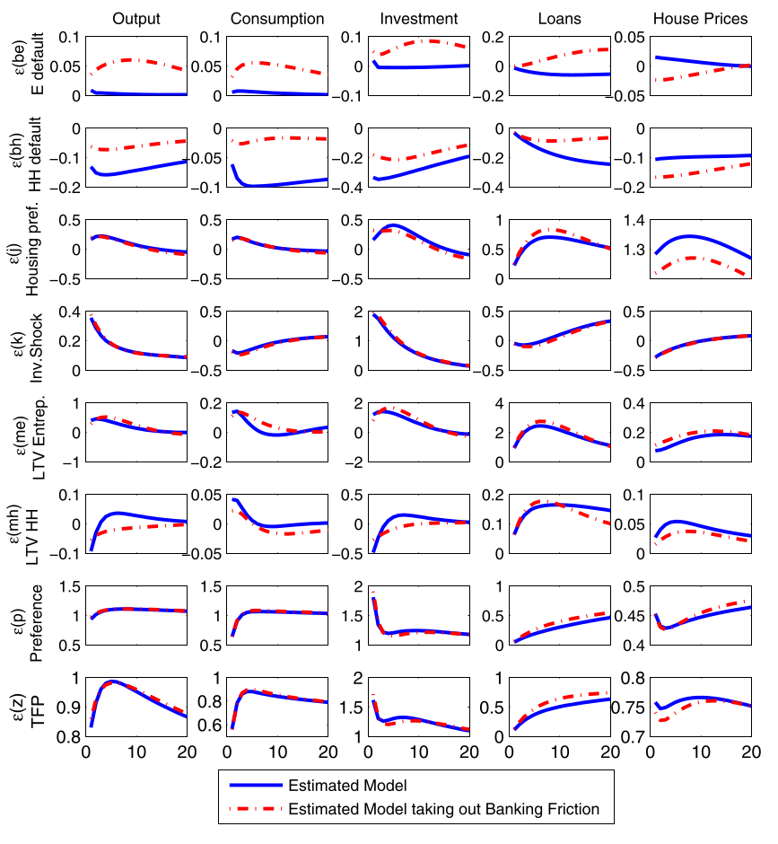
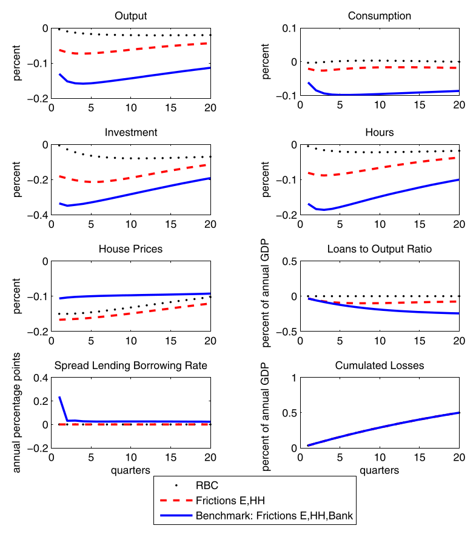

# L'importance des intermediaires financiers

## 

::: columns

:::: column

::::
:::: column

__Ben Bernanke__

::::: {.incremental}

- president de la Fed (2006-2014), succedant a Alan Greenspan
- surnomme Helicopter Ben
- etait un specialiste de la Grande Depression...
  - l'Etat / la banque centrale auraient du creer davantage de monnaie
- ...et a ensuite du faire face a la Grande Recession
  - l'Etat / la banque centrale auraient du etre plus attentifs a la situation des intermediaires financiers
- a recu le prix Nobel en 2022 avec Diamond et Dybvig
  - pour leurs travaux sur les banques et la necessite de leur renflouement 
  en periode de crise financiere
  - Bernanke (et d'autres) a integre des modeles realistes de banques (issus de D&D) dans des modeles DSGE

- Son discours de reception est [en ligne](https://www.nobelprize.org/prizes/economic-sciences/2022/bernanke/biographical/)

:::::

::::

:::

##  Marches du credit

Les marches du credit sont cruciaux pour comprendre :

::: {.incremental}

- les crises financieres
- la persistance des recessions "ordinaires" 
- la politique monetaire
- la regulation financiere et les politiques prudentielles
  - desormais integrees dans la "macropru", qui occupe une place importante dans les banques centrales

:::

## Problemes lies au credit 

::: {.incremental}

- Information imparfaite et asymetrique
  - les emprunteurs connaissent mieux leur capacite financiere
- -> Alea moral : peu d'incitations a adopter un comportement assurant le remboursement
- -> Probleme de selection adverse
  - les emprunteurs les plus risques ont davantage interet a demander des fonds

- Les banques et autres preteurs traitent ces problemes avec divers outils :
  - relation de long terme
  - filtrage (screening)
  - restrictions imposees aux emprunteurs (covenant[^covenant])
  - suivi (monitoring)
  - collateraux
:::

[^covenant]: D'apres Wikipedia : *Un covenant de pret est une clause d'un pret commercial ou d'une emission obligataire qui impose a l'emprunteur de respecter certaines conditions, lui interdit certaines actions, ou restreint certaines activites a des circonstances ou d'autres conditions sont satisfaites.*

## Prime de financement externe

::: {.callout-note title="Prime de financement externe"}

Le cout total d'un pret pour un emprunteur donne (y compris les couts lies aux covenants, aux exigences de collateraux, etc.), moins le taux d'interet sans risque (par exemple le rendement des titres publics).

:::

. . .

::: {.incremental}

- La prime de financement externe est le *cout* de l'intermediation
  - c'est une *distorsion* aux consequences macroeconomiques
- Elle est differente pour chaque emprunteur
  - elle depend de la taille et du risque

:::

. . .

Un enseignement cle de la litterature sur l'intermediation financiere

- La PFE est determinee par la valeur nette de *l'emprunteur* et du *preteur*

<!-- cf Groucho Marx "I wouldn't want to belong to a club that would have me as a member" -->

## 

__Accelerateur financier__[^finacc] :

- une PFE plus elevee : credit plus strict, moins de prets, ralentissement de l'economie
- une economie affaiblie degrade la sante financiere des preteurs et des emprunteurs, ce qui augmente la PFE

. . .

[^finacc]: En macroeconomie, l'accelerateur financier est le mecanisme par lequel des chocs negatifs peuvent etre amplifies par la deterioration des conditions financieres.

![Mesure de la prime de financement externe[^gilchrist]](assets/gz_spread.png)

[^gilchrist]: methodologie de Gilchrist et Zakrajsek (2012)

## La Grande Recession

::: {.incremental}

- La Grande Recession resulte de "ruptures de credit"
- Une grande partie des intermediaires etaient des *shadow banks* (banques d'investissement, societes de credit hypothcaire, fonds monetaires, ...) qui
  - n'avaient pas acces aux prets de la Federal Reserve comme les banques commerciales
  - se financaient a court terme
  - etaient *vulnerables* aux paniques bancaires
- Bernanke (2018) montre que, pendant la crise, les mesures de panique financiere (couts de financement) predisaient tres bien les variables *reelles*

:::

##

# Cycles financiers

## Cycles financiers

::: columns

:::: {.column width=40%}

::::

:::: {.column width=60%}

::::: {.incremental}

- Matteo Iacoviello
  - travaille au Federal Reserve Board
  - specialise en modelisation macro, notamment sur le marche immobilier

- [Financial business cycles](papers/FBC.pdf), Review of Economic Dynamics 2015
  - modele DSGE avec secteur financier et chocs financiers
  - le modele est estime
  - resultat : les recessions (cycles) sont declenchees par des chocs de credit

- Le modele est plutot simple du point de vue des microfondements
  - ... ce qui explique qu'il soit relativement mal publié

:::::

::::

:::

## Resume {auto-animate="true"}

Je considere une economie en temps discret.

L'economie comprend trois types d'agents : les menages, les banquiers et les entrepreneurs. Chaque type a une masse unitaire.

Les menages travaillent, consomment et achetent de l'immobilier, et placent des depots a un periode aupres d'une banque. Le secteur des menages est agregativement epargnant net.

Les entrepreneurs accumulent de l'immobilier, embauchent des menages et empruntent aux banques.

Entre menages et entrepreneurs, les banquiers intermedient les fonds. La nature de l'activite bancaire implique que les banquiers sont emprunteurs vis-a-vis des menages, et preteurs vis-a-vis du secteur dependant du credit, c'est-a-dire les entrepreneurs.

Les preferences sont construites de facon a ce que deux frictions coexistent et interagissent a l'equilibre : d'abord, les banquiers sont contraints dans la quantite qu'ils peuvent emprunter aux epargnants patients ; ensuite, les entrepreneurs sont contraints dans la quantite qu'ils peuvent emprunter aux banquiers.

## Resume {auto-animate="true"}

Je considere une economie en temps discret.

L'economie comprend trois types d'agents : <mark>les menages</mark>, <mark>les banquiers</mark> et <mark>les entrepreneurs</mark>. Chaque type a une masse unitaire.

Les menages travaillent, consomment et achetent de l'<mark>immobilier</mark>, et placent des depots a un periode dans une banque. Le secteur des <mark>menages</mark> est agregativement <mark>epargnant net</mark>.

Les entrepreneurs accumulent de l'immobilier, embauchent des menages et empruntent aux banques.

Entre menages et entrepreneurs, <mark>les banquiers intermedient les fonds</mark>. La nature de l'activite bancaire implique que les banquiers sont emprunteurs vis-a-vis des menages et preteurs vis-a-vis du secteur dependant du credit, c'est-a-dire les entrepreneurs.

Les preferences sont construites de facon a ce que deux frictions coexistent et interagissent a l'equilibre : d'abord, <mark>les banquiers sont contraints en credit</mark> dans la quantite qu'ils peuvent emprunter aux epargnants patients ; ensuite, <mark>les entrepreneurs</mark> sont contraints en credit dans la quantite qu'ils peuvent emprunter aux banquiers.

## Menages {auto-animate="true"}

L'agent representatif choisit le logement $H_{H,t}$, la consommation $C_{T,t}$ et le temps de travail $N_{H,t}$ pour resoudre

$$\max E_t \sum_{t=0}^{\infty} \beta^t_H \left( \log C_{H,t} + j \log H_{H,t} + \tau \log(1-N_{H,t}) \right)$$

ou $\beta_{H,t}$ est le facteur d'actualisation et $j,\tau$ deux parametres de preference.

. . .
 
sous la __contrainte budgetaire__ :

$$C_{H,t} + D_t + q_t \left( H_{H,t}- H_{H,t-1} \right) = R_{H,t-1} D_{t-1} + W_{H,t} N_{H,t} + \epsilon_t$$

ou :

- $D_t$ : depots bancaires remuneres au rendement brut $R_{H,t}$
- $q_t$ : prix du logement
- $W_t$ : salaire
- $\epsilon_t$ : choc redistributif (proxy des defauts)

## Menages {auto-animate="true"}

::: columns

:::: column

L'agent representatif choisit le logement $H_{H,t}$, la consommation $C_{T,t}$ et le temps de travail $N_{H,t}$ pour resoudre

$$\max E_t \sum_{t=0}^{\infty} \beta^t_H \left( \log C_{H,t} + j \log H_{H,t} + \tau \log(1-N_{H,t}) \right)$$

ou $\beta_{H,t}$ est le facteur d'actualisation et $j,\tau$ deux parametres de preference.
 
sous la __contrainte budgetaire__ :

$$C_{H,t} + D_t + q_t \left( H_{H,t}- H_{H,t-1} \right) = R_{H,t-1} D_{t-1} + W_{H,t} N_{H,t} + \epsilon_t$$

ou :

- $D_t$ : depots bancaires remuneres au rendement brut $R_{H,t}$
- $q_t$ : prix du logement
- $W_t$ : salaire
- $\epsilon_t$ : choc redistributif (proxy des defauts)

::::

:::: column
On obtient les conditions d'optimalite suivantes :

$$\frac{1}{C_{H,t}} = \beta_H E_t \left( \frac{1}{C_{H,t+1}} R_{H,t} \right)$$
$$\frac{q_t}{C_{H,t}} = \frac{j}{H_{H,t}} + \beta_H E_t \left( \frac{q_{t+1}}{C_{H,t+1}}  \right)$$
$$\frac{W_{H,t}}{C_{H,t}} = \frac{\tau}{1-N_{H,t}}$$

::::
:::

## Entrepreneurs

L'entrepreneur representatif choisit la consommation $C_{E,t}$, l'immobilier $H_{H,t}$, la production $Y_t$, le temps de travail $N_{E,t}$, la dette $L_{E,t}$: $$\max E_0 \sum_{t=0}^{\infty} \beta^t_E \log C_{E,t}$$

sous :

$$C_{E,t} + q_t \left( H_{E,t} - H_{E,t-1} \right) + R_{E,t} L_{E,t-1} + W_{H,t} N_{E,t} + a c_{EE,t} = Y_t + L_{E,t}$$

$$Y_t = H^{\nu}_{E,t-1} N^{1-\nu}_{E,t}$$

$$
L_{E,t} \leq m_H E_t \left( \frac{q_{t+1}}{R_{E,t+1}}H_{E,t} \right) - m_N W_{H,t} N_{E,t}
$$ {#eq-borrowing-constraint}

- $L_{E,t}$ sont les prets a l'entrepreneur, au rendement brut $R_{E,t}$

- $c_{EE,t}=\frac{\phi_{EE}}{2}\frac{\left(L_{E,t}-L_{E,t-1}\right)^  2}{L_E}$ avec $L_E$ l'etat stationnaire de $L_{E,t}$ 
  - capte le fait que les prets evoluent lentement

<!-- [^external_1]: le cout d'ajustement quadratique est suppose *externe* au banquier -->

##

Contrainte d'emprunt :

$$
L_{E,t} \leq m_H E_t \left( \frac{q_{t+1}}{R_{E,t+1}}H_{E,t} \right) - m_N W_{H,t} N_{H,t}
$$ {#eq-borrowing-constraint}

- les entrepreneurs ne peuvent pas emprunter plus qu'une fraction $m_H$ de la valeur anticipee de leur stock immobilier
- une fraction $m_N$ de la masse salariale doit etre payee d'avance
  - les entrepreneurs ne peuvent pas emprunter pour la financer

Hypothese : les entrepreneurs actualisent davantage le futur que les menages et les banquiers 

$$\beta_E < \frac{1}{\gamma_E \frac{1}{\beta_H} + (1-\gamma_E)\frac{1}{\beta_B}}$$ avec $\gamma_E\in[0,1]$

## Entrepreneurs : conditions d'optimalite

On obtient les conditions d'optimalite suivantes

$$\left( 1- \lambda_{E,t} - \frac{\partial ac_{LE,t}}{\partial L_{E,t}}\right) \frac{1}{c_{E,t}} = \beta_E E_t \left( R_{E,t+1} \frac{1}{c_{E,t+11}}\right)$$

$$\left(
  q_t- \lambda_{E,t} m_H E_t \left( \frac{q_{t+1}}{R_{E,t+1}} \right)
\right)\frac{1}{c_{E,t}} = \beta_E E_t \left( 
  \left(q_{t+1} + \frac{\nu Y_{t+1}}{H_{E,t}}
  \right)
  \frac{1}{c_{E,t+1}}\right)
  $$

$$\frac{(1-\nu)Y_t}{1+m_N \lambda_{E,t}}=W_{H,t} N_{H,t}$$

__Commentaire__ : la contrainte de credit introduit un ecart entre le cout des facteurs et leur produit marginal.

  - une distorsion comparable a une taxe

## Banquiers

Le banquier representatif maximise sa consommation privee $C_{B,t}$ 

$$\max E_0 \sum_{t=0}^{\infty} \beta^t_B \log C_{B,t}$$

$$C_{B,t} + R_{H,t-1} D_{t-1} + L_{E,t} + a c_{EB,t} = D_t + R_{E,t} L_{E,t-1} - \epsilon_t$$

ou :

- $D_t$ : depots des menages
- $L_{E,t}$ : prets aux entrepreneurs
- $a c_{EB,t} = \frac{\phi_{EB}}{2} \frac{(L_{E,t-L_{E,t-1}})^2}{L_E}$ est un cout d'ajustement quadratique[^external_2]

- la capacite a transformer les depots en prets est limitee par une contrainte d'emprunt[^capital]

$$D_t \leq \gamma_E \left( L_{E,t} - E_t \epsilon_{t+1} \right)$$

[^external_2]: le cout d'ajustement quadratique est suppose *externe* au banquier
[^capital]: ici, c'est equivalent a une contrainte plus realiste sur le ratio de capital

## Banquiers (optimalite)

Notons :

- $m_{B,t} = \beta_B \left( \frac{C_{B,t}}{C_{B,t+1}}\right)$ : le facteur d'actualisation stochastique du banquier
- $\lambda_{B,t}$ : multiplicateur de la contrainte de fonds propres *normalise par l'utilite marginale de la consommation*

Conditions d'optimalite :

$$1-\lambda_{B,t} = E_t \left( m_{B,t} R_{H,t} \right)$$ {#eq-foc-banker-1}

$$1-\gamma_{E} \lambda_{B,t} + \frac{\partial ac_{EB,t}}{\partial L_{E,t}} = E_t \left( m_{B,t} R_{E,t+1} \right)$$ {#eq-foc-banker-2}

Ces deux equations expliquent l'ecart entre le taux de depot et le taux de pret (la prime d'intermediation)

## Banquiers (optimalite)

$$1-\lambda_{B,t} = E_t \left( m_{B,t} R_{H,t} \right)$$

$$1-\gamma_{E} \lambda_{B,t} + \frac{\partial ac_{EB,t}}{\partial L_{E,t}} = E_t \left( m_{B,t} R_{E,t+1} \right)$$

__Interpretation__ :

- le banquier peut consommer davantage en empruntant aux menages pour financer sa consommation
  - cela resserre sa contrainte de credit
  - cela reduit la valeur d'un depot supplementaire de $\lambda_{B,t}$
- le banquier peut consommer davantage en reduisant les prets
  - cela resserre aussi sa contrainte de credit (baisse des fonds propres)
  - l'effet est plus fort si l'exigence de collateraux est plus elevee

## Equilibre des marches

Conditions d'equilibre sur logement :

$$H_{E,t} + H_{H,t} = 1$$

Conditions d'equilibre sur les marches du travail :

$$N_{H,t} = N_{E,t}$$

Conditions d'equilibre sur le marché des biens:

$$Y_t = C_{H,t} + C_{E,t} + C_{E,t} + a c_{EE,t} + a c_{EB,t}$$

## Proprietes de l'etat stationnaire

::: columns

:::: column

Pour les __menages__ :

$$R_H=\frac{1}{\beta_H}$$

Pour les __banquiers__ :

@eq-foc-banker-1 et @eq-foc-banker-2 impliquent que tant que $\beta_B<\beta_H$, les banquiers sont contraints en credit

Avec $\gamma_{E}$ inferieur a 1, il existe un spread entre le rendement des prets et celui des depots :

$$\lambda_B = 1-\beta_B R_H = 1-\frac{\beta_B}{\beta_H}>0$$

$$R_E = \frac{1}{\beta_B} - \gamma_E \left( \frac{1}{\beta_B} - \frac{1}{\beta_H} \right)>R_H$$

::::
:::: column

Pour les __entrepreneurs__

Les entrepreneurs sont contraints si $\beta_E R_E<1$.
Ce qui est equivalent a $$\frac{1}{\beta_E}=\gamma_E \frac{1}{\beta_H} + (1-\gamma_E) \frac{1}{\beta_B}$$

__Effet__ :

- les contraintes de credit des banquiers et des entrepreneurs creent un ecart et reduisent la production de long terme

__Hypothese technique__ : a l'etat stationnaire, les contraintes sont saturantes. Iacoviello suppose qu'elles le restent dans un voisinage de l'etat stationnaire.

::::
:::

## Calibration

::: columns

:::: column

Periode de temps : 1 trimestre

Facteurs d'actualisation :

- menages : $\beta_H=0.9925$
- banquiers : $\beta_B=0.945$
- entrepreneurs : $\beta_E=0.94$

Choix des parametres de levier de sorte que $R_H=3%$ et $R_E=5%$.

::::
:::: column

Couts d'ajustement : $\phi_{EE}=\phi_{EB}=0.25$

Poids du loisir dans l'utilite : $\tau=2$ (temps de travail actif = 1/2 et elasticite de Frisch[^frisch] proche de 1).

Part du logement dans la production : $\nu=0.05$

Parametre de preference pour le logement $j=0.075$ : ratio richesse immobiliere / production = 3.1 (0.8 commercial, 2.3 residentiel)

Levier :

- $m_N=1$ : tout le travail est paye d'avance
- $m_H=0.9$ : loan-to-value (LTV) des entrepreneurs
- $\gamma_E=0.9$ : levier bancaire (proche des ratios historiques de capital sur actifs)

::::
:::

[^frisch]: Frisch mesure la reponse du temps de travail aux variations de salaire

## Dynamique

Dynamique du spread d'intermediation

$$E_t \left( R_{E,t+1} \right) - R_{H,t} = \frac{\lambda_{B,t}}{m_{B,t}}(1-\gamma_E)$$

## Premiere simulation

Le choc $\epsilon_t$ est calibre sur les pertes historiques sur prets (montants de depreciation de dette)

On a $$\epsilon_t = 0.9 \epsilon_{t-1} + \iota_t$$

La deviation exogene est la suivante

- hausse de 0.38% du PIB chaque trimestre pendant 12 trimestres
- les pertes du systeme financier passent de 0 a 2.8% apres 2 ans
- retour progressif vers zero

## Premiere simulation

## Modele etendu

Le modele complet contient :

- deux types de menages :
  - patients : preteurs aux banques
  - impatients : 
    - contraints en credit : empruntent a la banque
    - chocs redistributifs banques-menages impatients
- habitudes de consommation + chocs de preference $$\max E_t\sum_t \beta^t \log(C_t -\eta C_{H,t-1}) + j A_{j,t} \log(H_{H,t}) + \tau \log(1-N_{H,t})$$
- chocs sur toutes les capacites d'emprunt
- chocs d'efficacite de l'investissement + chocs de PTF

Modele estime par une approche bayesienne de 1985 a 2010

- 8 chocs au total
- 8 variables observables

## Calibration

## Resultats d'estimation

## Resultats d'estimation

## Identification

. . .

Un modele estime peut etre utilise pour *identifier* les chocs.

- l'essentiel des variations des prix immobiliers et des volumes de credit peut etre attribue aux chocs financiers
- une part importante des fluctuations de la production et de l'investissement aussi

## Pouvoir predictif du modele {auto-animate="true"}

## Pouvoir predictif du modele {auto-animate="true"}

::: columns

:::: column

::::
:::: column

Le modele predit aussi d'autres moments qui n'etaient pas cibles :

- spreads de taux d'interet
- taux d'utilisation des capacites
- profits des entreprises $\approx$ consommation des banquiers

::::
:::

## Conclusion

Le modele FBC montre que les chocs financiers ont probablement ete un moteur de la crise financiere (🤔)

\ \ \ 

. . .

Mais il manque :

::: {.incremental}

- un modele microfonde et realiste des banques
- un role pour la banque centrale et la creation monetaire
  - en particulier la creation monetaire par les banques...

- un environnement macroeconomique plus realiste
  - en particulier, le capital

:::

# Appendix

## IRF du modele complet (1)

## IRF du modele complet (2)

